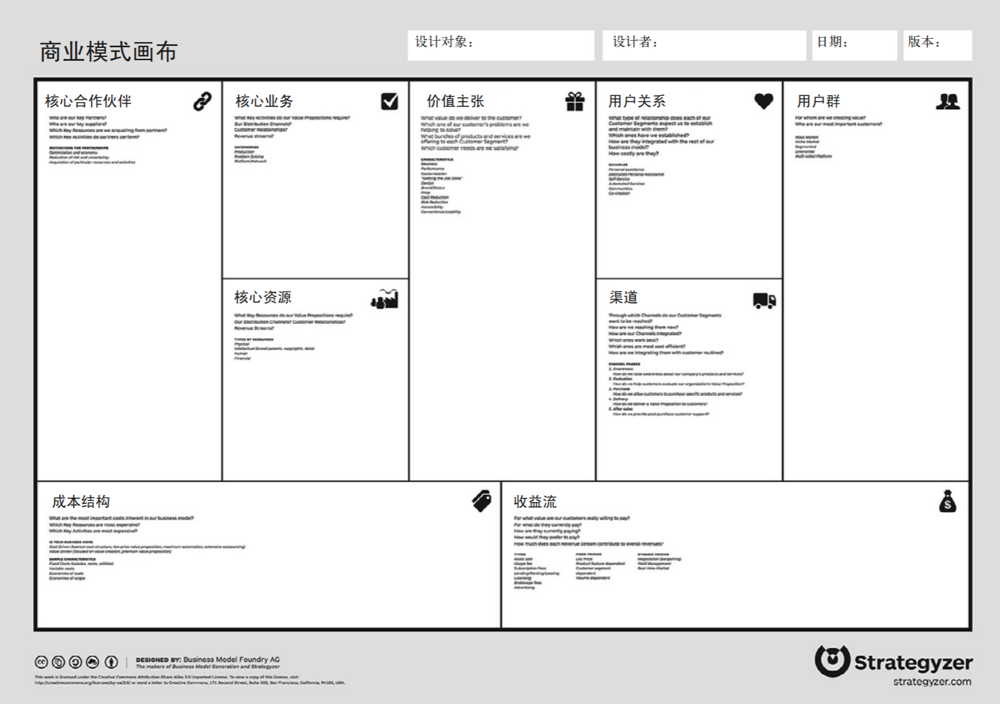
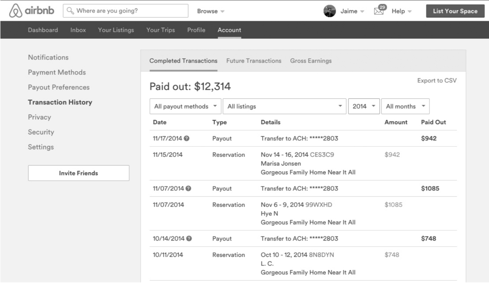
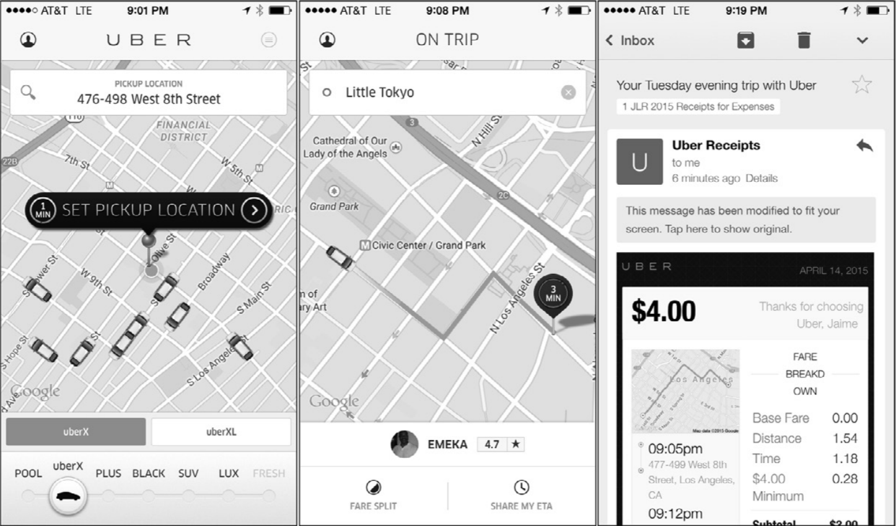
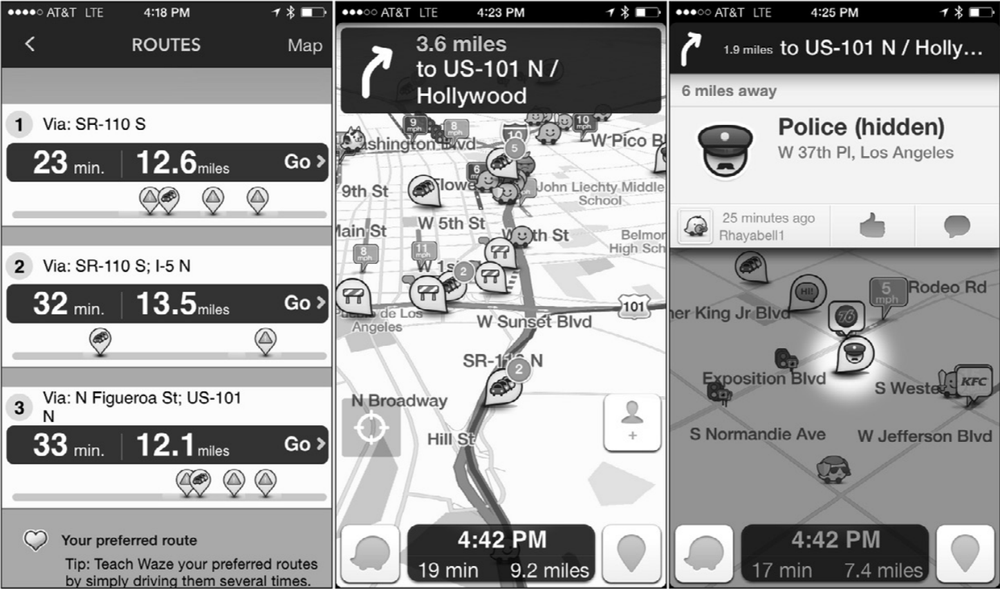

[[toc]]


## C1 什么是用户体验策略

> 我看见了针管和伤害，每个人都多少与之有关 <p style="text-align: right;">- Neil Young (1972)</p>

用户体验究竟能否为用户创造真正的价值，能否为干系人带来真正的回报，其决定因素就在于团队如何执行调研阶段。


颠覆性创新 - 改变旧的心智模式

## C2 用户体验策略的四条准则

> 兵贵胜，不贵久 <p style="text-align: right;">- 《孙子兵法》孙武</p>

```
     商业策略 ----- 创新价值
        |             |
        |             |
        |             |
可靠的用户调研 ----- 杀手级用户体验设计
```

#### 准则1：商业策略


商业模式画布（九个必要部分）



1. 用户群:用户是谁？他们有什么行为特征？他们的需求和目的是什么？
2. 价值主张:我们承诺带来什么价值（定性或定量）？
3. 渠道:我们如何接触到用户？通过线下还是线上？
4. 用户关系:我们如何获取以及留住用户？
5. 收益流:产品如何通过价值主张赢利？用户会为此付费吗？是否存在其他方式？
6. 核心资源:必须拥有怎样独特的战略性资产才可以让产品成功？是内容、资本，还是专利？这个优势是必不可少的吗？
7. 核心业务:公司提供了怎样独特的业务模式？是优化一个过时的商业流程？还是打造一个汇聚用户的交易平台？
8. 核心合作伙伴:为了实现价值主张，需要怎样的合作伙伴以及供应商？
9. 成本结构:为了实现商业模式，最主要的成本是什么？是否会裁减功能以降低成本？是否存在甩不掉的固定成本？

商业模式画布可以帮助产品开发者把对产品的所有假设汇集到一起，然后就可以在调研阶段逐步修正它们，这些都是构建产品用户体验的必要条件，也是竞争优势的关键所在。

- 干系人
  - 核心资源
  - 核心合作伙伴
- 产品团队
  - 核心业务
  - 用户群
  - 价值主张


策略可能的目的
- 对于新产品：尽可能匹配市场的需求以便融资，或者在于抢占市场份额，使得用户基数成为竞争优势
- 对于更成熟的公司：发展公司的核心价值主张，同时保持公司结构和内部流程的稳定。

在实施方案前要向用户收集数据，策略要保持足够敏捷，在各个过程中反复优化修改

#### 准则2：价值创新

传统行业价值链：

市场调研->产品设计->原料采购->制造->市场营销->销售->售后服务

在价值链的任意一个环节具备优势，产品就有脱颖而出的机会。相反，虚拟产品价值链的闭环更小，有时候某些环节是并行的。


```
    -----------
    |  成本   | 
    |         |
----+---------+----
|   | 价值创新 |   |
|   +---------+   |
|                 |
|     用户价值     |
-------------------

```

价值创新 = 同时追求`差异化`以及`低成本用户体验`和`商业模式`的结合

追求差异化与成本领先的公司能为用户和干系人提供更有用更便宜的产品

#### 准则3：可靠的用户调研

用户调研就是要确定自己的价值主张是否正确，可靠的用户调研即经过验证的用户调研

做任何产品都是一次冒险

用户越早认可你的价值主张，产品的风险就越小

当走访目标用户时，发现他们并没有付费意愿（实现收益流）

传统调研方法：人种学现场研究，情景问答，焦点小组，日志分析，卡片分类，视线追踪，角色扮演
精益创业：最小可行产品 （minimum viable product MVP）只要开发出产品的核心功能特性，然后看它是否是潜在用户想要的

团队在确定方案之前需要利用最小可行产品的持续迭代来调研并验证。这能确保团队面向正确的目标用户。

可靠的用户调研是一个团队协作的过程，参与进来的团队成员越多越好，无论面对眼前的价值主张还是以后其他的发展方向，团队成员都可以通过互相协作达成共识。


#### 准则4：杀手级用户体验

设计`产品界面`和`用户转化路线`时应该带着目的，时刻想着用户在参与。关注用户可能遇到的障碍，因为这很可能让`二次访客`放弃消费

杀手级用户体验设计专家实现价值创新的方式：

- 他们与干系人以及团队成员在产品概念方面精诚合作。用户体验设计师能够参与设计结构化的验证性实验。所谓实验，要求从用户打开着陆页的那一刻开始就关注产品是否成功向用户传递价值主张。有了可量化的结果，即可根据真实证据而非直觉来决策。
- 他们可以帮助确定产品的关键功能和使用过程中关键的时间点，这些对于产品来说至关重要。第6章将探讨一些策略性技巧，帮助你发现价值创新点，并专注于产品的核心竞争力。我们将探索各种技巧，如使用故事板把关键体验以简单优雅的方式编织起来。我们将参考竞争对手和非竞争对手的功能特性，集百家之所长。
- 他们从市场中学习，寻找所有可能的机会改善用户体验。这将使团队能够创造独特的价值，让人们的生活更有效率。
- 他们直接与潜在用户或现有的核心用户对话，探索并验证产品能够解决哪些需要被解决的痛点。
- 他们综合考虑用户所能接触的所有环节，打造连贯流畅的线上和线下体验。这一点尤其针对像Airbnb和Uber这样的产品。它们的交易流程始于互联网，并终于现实世界，但最后用户还会回到互联网给出评价。








#### 十大用户体验策略误区

``` diff
- 1. 只有新产品才需要杀手级的创意。
- 2. 只列出一长串功能特性。
- 3. 充分研究并全盘计划，所有可能的情形都考虑到位，只欠实施。用户反馈毫无必要，自认为已经有100%的把握。
- 4. 只因为有些创业公司融资成功，就创造性重新组合这些公司所使用的概念热词（比如，P2P分享经济）。
- 5. 通用的励志口号（比如“向前冲！把握机遇，我们是征服者！”）。
- 6. 引用某专家的傲慢宣言：“我们的产品源自神奇教授的天赋才能，他是社会精益颠覆的预言家。”
- 7. 未经验证的高风险假设：“所有女性都爱粉红色。”
- 8. 公司根本无法实现的浮夸愿景（比如，准备申请专利，梦想着实现崭新的伟大发明）。
- 9. 听起来像祝福语的含糊断言：“你也可以实现社会精益颠覆！”
- 10. 寻找“北极星”。
```


## C3 确定价值主张

> 要了解商业是什么，得先知晓其目的。事实上，商业的目的并不在于商业本身。因为公司就像社会的器官，所以要站在社会的角度看其目的。所谓商业的目的，其有效定义只有一个：拥有顾客。 <p style="text-align: right;">- 彼得 · 德鲁克</p>


如何构思价值主张，并让顾客对这个概念可观可感

#### “那个激动人心的价值主张”

经验总结
- 干系人（或者你自己）特别喜欢某产品，不意味着其他人同样喜欢。多数创业公司失败的原因在于市场根本不需要他们的产品
- 你需要用事实证据让干系人和团队脚踏实地，抛弃假设，直面真相。
- 不要轻易相信干系人或团队成员的话，若要了解潜在客户的真实需求，你需要和他们面对面交谈


#### 什么是价值主张

价值主张：提取出零散、易记、有感染力、朗朗上口的词语来表达产品究竟能为顾客带来什么好处

eg:
- Airbnb 是一个社区型市场，人们可以在这里通过互联网发布、发现和预定世界各地的独特房源
- Snapchat 是分享信息最快的方式，你可以在最短的时间里向朋友们分享短信、照片、视频、文章和手绘
- Waze 是一款社会化交通和导航应用。它拥有世界上最大的司机社群，司机会在开车时基于该群体的“共同利益”实时分享路况信息。

<http://itsthisforthat.com>价值主张的生成公式：

这就像用于 `<顾客的类型和需求>`的`<某个著名平台或应用>`


步骤 1：定义核心顾客群。
顾客群就是有共同需求或痛点的一群人。核心顾客群的痛点必须很迫切，顾客群要清晰，只需十个或更少的词就能描绘他们。


步骤 2：找到该顾客群面临的（最大）问题。
提出假设
通过逆向分析验证关于顾客及其问题的假设（不能以偏盖全）

> 在拿到切实的证据证明你的产品之前，不要着急围绕价值主张设计用户体验 


步骤 3：基于假设创建临时人物角色。

人物角色是个有用的工具，他能帮助干系人以及产品团队感知最终用户的需求、目标和动机。通过这种方式，就能设计出对用户更加友好的产品。对于条件有限的产品开发团队，可以使用**临时人物角色**。临时人物角色纯粹是作为理解核心顾客群的思维工具，应保持其结构和层次上的简洁。虽然构思出的人物各方面可能会大相径庭，但这个问题在假设阶段无关紧要。之后要做的是在现实生活中找到符合各自人物角色的顾客，看看他们的真实想法！

临时人物角色的组成

1. 姓名和肖像
  如果人物某一特征是确定的，你可以搜一下那个年代流行的新生儿名字，如果你会手绘就把他画下来。如果你知道谁刚好符合这个形象，直接把照片复制过来。如果没有照片，那就Google 一张参考照片
2. 描述
  这位顾客的个性特征是什么？描述应该是与产品概念相关的综合性顾客原型，而非机械罗列心理或统计学细节。举个例子，如果想做一款与汽车相关的产品，那就只需要关注顾客在汽车方面的品位。
3. 行为
  这部分问题可以通过多个角度解读。
  - 首先，想想顾客当前是如何解决他们的问题的。是通过互联网找到变通的方法吗？通过线上、线下还是两者兼有？顾客对科技是否足够熟悉，是否能够利用互联网解决此问题？他们是否使用社交网络？如果世面上已有类似的互联网产品，那么其用户是否存在普遍行为？
  - 其次，想想顾客的个性将怎样影响他的行为。比如，作为职场达人的他是否同样善于解决生活中的问题？顾客习惯与信任还是怀疑？
4. 需求和目标
  这部分解释了顾客做出某些行为的原因。比如，顾客当前的解决方式有哪些欠缺？他当前的行为无法满足哪些具体的需求和目标？顾客面临的阻碍是什么？妥协点在哪里？


步骤 4：开展顾客探索，以验证最初的价值主张。

- 顾客探索：是一个挖掘、测试、验证的过程。该过程研究特定产品是否可为目标群体解决眼前问题，其本质是做用户调研。不应该只是观察，共情然后做出判断；相反应该走出办公室开展用户调研

- 问题访谈：与真实人物（与人物角色相匹配的人）对话，验证临时人物角色，如果现实世界找不到他们，可以到网上找找 C8

  - 筛选：用一系列问题筛选出潜在的访谈对象。筛选性问题将确定“控制组”，我们最终要通过他们验证各种假设。好的筛选性问题必须能迅速剔除不相关人员，并且不能冒犯参与者。有时候你需要交流多次才能真正确认，对方就是你要找的人。你完全可以随机应变根据现场状况调整，使你的问题更具体或者更笼统
  - 访谈：不要开始夸耀价值主张的闪光点，在你开始向陌生人推介想法时，他们往往会立即点头同意然后尽快溜走。顾客探索的关键是倾听而非推销

- 双边市场：如果产品要为两类用户创造价值，我们要为两种顾客群分别设计用户体验并验证它们

eg:
```diff
Bita 身着得体的职业装，她拿在手中的笔记本记录待询问的问题，
并且只在恰当的时机微笑着靠近她的目标客户（比如在他们的小孩正在婴儿车中熟睡时）。
以下是她的开场白：

- “你好，我是Bita，我在为一家互联网创业公司的某产品开展市场调查，您可以抽出几分钟回答几个与筹办婚礼相关的问题吗？” 

阶段1：筛选性问题
- “您是在近几年结婚的吗？”
+ “是” - 继续问题2
+ “否” - 友好结束交谈

- “您刚好就在洛杉矶结婚的吗？”
+ “是” - 进入访谈环节
+ “否” - 友好结束交谈

阶段2：开始访谈
- (1) “您当初是怎么筹备婚礼的？” - 给对方提示:仪式与招待地点、筹备途径（比如互联网、口碑）
- (2) “对于婚礼场地是否有预算？是否将实际开支控制在预算范围内”（如果超支，超出了多少）
- (3) “您在筹备婚礼是计划接待多少人”（比如50或100）
- (4) “您在寻找合适场地过程中遇到了什么挑战？”（提示：如找到靠近海滩的理想场地）
- (5) “您是怎么克服这些挑战的？是否最终在理想婚礼这一问题上选择妥协？”

这些问题其实为我们的解决方案设定了情境。现在访谈对象已置身情境中，是时候抛出金钱相关的问题了。

- “很好，非常感谢您的反馈。我最后还有两个问题”

- (6) “您是否听说或使用过一个叫 Airbnb 的网站？”
+ “是” - 继续问题7
+ “否” - 简单介绍 airbnb 关于短租房屋的价值主张，然后继续问问题7

- (7) “如果现在有个类似 Airbnb 的网站，上面有许多位于洛杉矶且带宽敞后院的漂亮房子，供您租下来当做婚礼场地，您觉得怎样？”

最后要用关系到金钱的问题结束访谈，此时你已经展示了自己设想的价值主张。再强调一遍，要倾听，不要推销。
Bita 的提问都是开放式的。她只是把解决方案推上台面，客观地观察在没有任何引导的情况下，对方会做何反应。
提出与金钱相关的问题后，只需捕捉对方的自然反应。如果对方想尝试，就会继续询问几个相关的问题，然后就此打住！
真诚地感谢对方参与，然后让她继续忙自己的事。理想情况下，从筛选性问题走到最终涉及金钱的问题，尽量完整收集10份这样的访谈。
```


步骤 5：基于已有信息重新评估价值主张。
（不断重复以上步骤，直到产品符合需求。）

有了反馈之后，你和你的团队需要作出决定。这是因为以下三种情形之一必然已经发生

- 顾客假设未能得到验证，所以你需要重新思考谁才是你真正的顾客。回到步骤1
- 没能验证顾客的痛点，所以你需要重新思考顾客面临的问题回到步骤2
- 关于顾客及其痛点的假设都得到了验证。你对自己的解决方案所体现的价值主张信心满满。那么请阅读C4 

> “不要将人物角色原型与典型形象混为一谈，因为人物角色不仅要准确提供设计目标，还要作为开发团队成员之间的沟通工具。设计者必须谨慎地根据统计学特征设定人物角色。” - Alan Cooper


## C4 开展竞争力调研

> 你是对的，我已误入歧途<br>
> 我们已入谷底，万丈峡谷<br>
> 此刻身处这里，没有出路<br> <p style="text-align: right;">- Sonic Youth Bank (1984)</p>

#### 吃一堑，长一智
- 在开始做新生意之前，尽量了解它如何运转起来。别被热情冲昏头脑。
- 调查你的竞争对手。他们哪里做得好？哪里做得不好？为什么顾客应该选择你？
- 当你实在力不从心时，要勇于承认失败。失败很正常，但是要爬起来，或者换个方向！

## C5 开展竞争力分析

## C6 用故事版描绘价值创新

## C7 创建实验原型

## C8 开展游击式用户调研

## C9 为转化而设计

## C10 策略师访谈

## C11 结语 